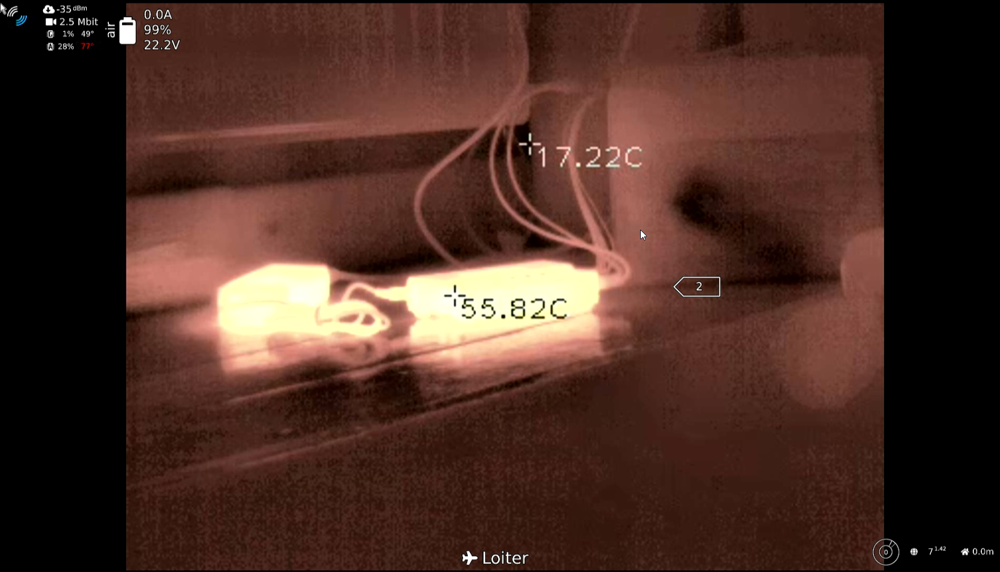

# WIP OpenHD HT301 Thermal Camera Driver
HT-301 thermal camera driver based on Python and OpenCV.

It is a driver that can be used with OpenHD in order to not only stream the thermal camera feed,
but also show temperature data, and switch the colormaps with rc channels.



This project uses the ht301_hacklib library from stawel: https://github.com/stawel/ht301_hacklib

# Installation
Connect the AirPi via Ethernet to the Internet. Then you can connect to the Airpi via SSH.

To have no problems with the commands switch to root user with:
```
sudo -s
```
First of all we need another v4l2loopback device.
To register this device on boot add the following line to /etc/modules:
```
v4l2loopback
```

and create the file /etc/modprobe.d/v4l2loopback.conf and add:
```
options v4l2loopback devices=1 exclusive_caps=1 video_nr=5 card_label="OpenCV-Output"
```

After that you update the modules:
```
update-initramfs -c -k $(uname -r)
```

Reboot the AirPi and check if the virtual video device was created:
```
v4l2-ctl --list-devices
```

## Dependencies
For the driver to work it is necessary to install the required python modules.
But there is a problem with pip. Because pip will download and unpack the packages in the /tmp partition and the /tmp partition has not enough space for this,
we need to add a folder to the big root partition in order to use it as a temporary tmp folder just for this single pip installation:
Make sure you expanded the Filesystem first:
```
raspi-config --expand-rootfs
```
and reboot.

Create a folder in /
```
mkdir /tmptmp
```
Then you can install the modules with pip3 (it will not work with "pip" because of python2)
```
TMPDIR=/tmptmp pip3 install numpy opencv-python v4l2 dronekit asyncio pyserial=3.4
```
OpenCV also needs the backbone to run, so install these packages too:
```
apt-get update -y && apt-get upgrade -y
apt-get install libcblas-dev -y
apt-get install libhdf5-dev -y
apt-get install libhdf5-serial-dev -y
apt-get install libatlas-base-dev -y
apt-get install libjasper-dev  -y
apt-get install libqtgui4  -y
apt-get install libqt4-test -y
apt-get install git
```
Because of an incompatibility issue on v4l2 with python3 you maybe need
to edit the lines **197** and **248** of the file /usr/local/lib/python3.7/dist-packages/v4l2.py
and change
```
range(1, 10) + [0x80]
```
to
```
list(range(1, 10)) + [0x80]
```

## Driver files
Then you can put the necessary files to /home/pi:
```
git clone https://github.com/MCMH2000/OpenHD_HT301_Driver
```

## Register driver as service on boot
copy the ht301_driver.service file to /lib/systemd/system:
```
cp ./ht301_driver.service /lib/systemd/system/ht301_driver.service
```
Then set the necessary permissions and make the driver executable:
```
chmod 644 /lib/systemd/system/ht301_driver.service
chmod +x /home/pi/OpenHD_HT301_Driver/ht301_driver.py
```
Then enable and start the new service:
```
systemctl daemon-reload
systemctl enable ht301_driver.service
systemctl start ht301_driver.service
```

## OpenHD config
Finally to stream the driver output via OpenHD you just have to edit your openhd-settings-1.txt
and change the gstreamer line for the ht301 to:
```
#Hti-301 thermal camera - 384 x 288 @ 25fps
USBCamera="gst-launch-1.0 v4l2src device=/dev/video5 ! video/x-raw ! videoconvert ! v4l2h264enc ! h264parse config-interval=3 ! rtph264pay mtu=1024 ! udpsink host=127.0.0.1 port=5600"
```
because the /boot partition is mounted as read only you may not be able change this via SSH.

After reboot you can then see your processed thermal image on the GroundPi.
