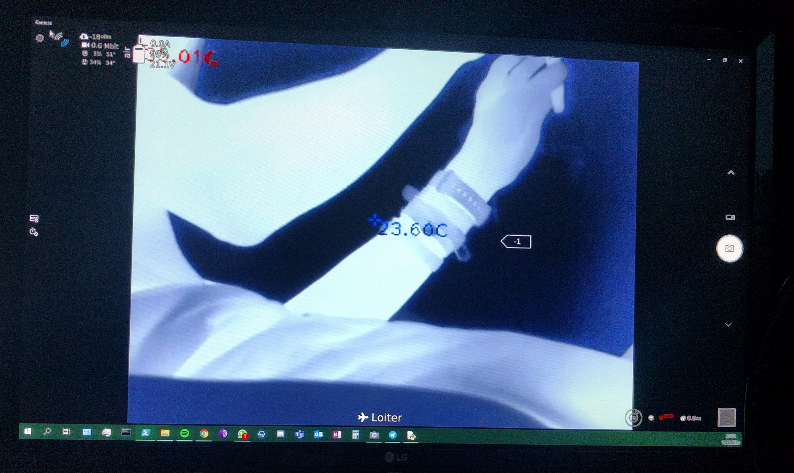

# WIP OpenHD HT301 Thermal Camera Driver
HT-301 thermal camera opencv python driver.

It it a driver that can be used with OpenHD in order to not only stream the thermal cameras feed,
but also get temperature data, and switch the colormaps with rc channels.

This project uses the ht301_hacklib library from stawel: https://github.com/stawel/ht301_hacklib
